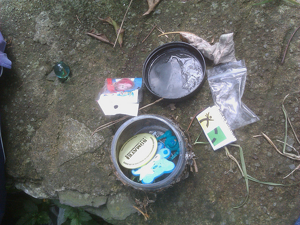
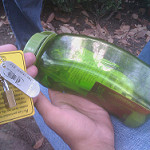
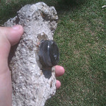
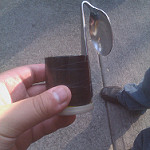
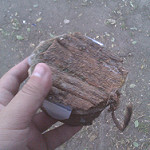
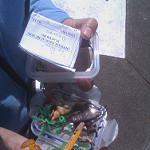
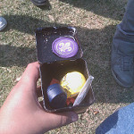

Llevo aproximadamente dos meses en los cuales he estado vagando en la ciudad, merodeando y buscando cosas que la mayoría de la gente no sabe que están ahi. ¿Por qué? Bueno, todo es parte de un nuevo pasatiempo llamado Geocaching, el cual puede definirse, según el [sitio oficial](http://www.geocaching.com/), como:

> El Geocaching es una búsqueda de tesoros a través de todo el mundo, jugado por aventureros equipados de un equipo GPS. La idea básica es localizar contenedores escondidos al aire libre y compartir las experiencias online.
>

Es algo bastante divertido que me ha llevado a conocer lugares que de otro modo jamas hubiera visto, ademas de el ejercicio que se hace al caminar de un lado a otro por toda la ciudad. Dentro de los contenedores, dependiendo del tamaño, suele haber desde un solo logbook para firmar hasta juguetes varios para intercambiar:

Actualmente llevo 40 caches encontrados, algunos muy sencillos y otros bastante ingeniosos, y me estoy preparando para esconder mis primeros contenedores. Uso mi HTC con Android para hacer esto, aunque ya estoy en proceso de comprarme una unidad GPS para poder ir a lugares mas alejados sin problema de perder la señal.

Hay algunos contenedores muy sencillos, pero otros que simplemente son bastante ingeniosos, tal asi que puedes tenerlos en la mano y no darte cuenta de lo que en realidad son..

[ ](http://farm2.staticflickr.com/1145/5138774047_1fb58c43cd_b.jpg &#34;Monumento al Chocho&#34;)  

Aquí en el DF ya hay mas de 1000 caches escondidos, desde los tradicionales hasta los virtuales. De los grandes a los nanos. En fin, es una actividad de lo mas recomendable, tanto para hacerla solo como en compañía de familia o amigos. Inténtelo si tienen oportunidad, ¡verán que no se arrepienten!

Pueden ver [mi perfil](http://www.geocaching.com/profile/?guid=8514e7a9-28b0-4547-8ef2-26b7bf31fca8) en Geocaching.com y una galería de imágenes que he tomado durante este tiempo en el set de [Geocaching en Flickr](http://www.flickr.com/photos/oso96_2000/sets/72157625076985648/detail/).